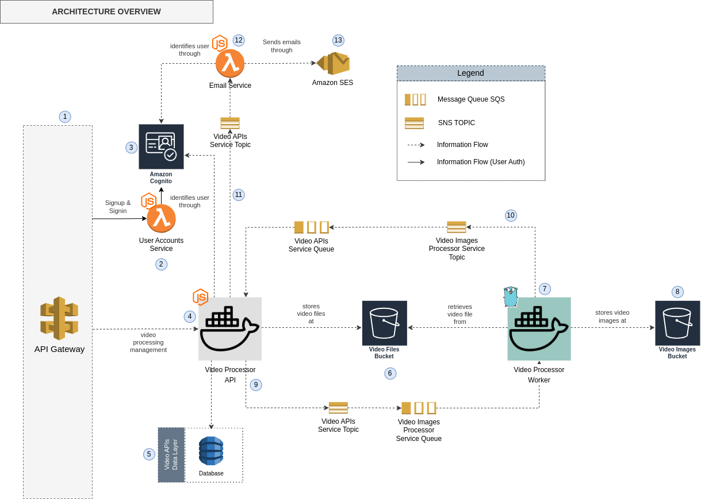

# Architecture Overview

## System Architecture

This document describes the architecture of the **Video Image Extraction System**, which ensures **resilience, scalability, security, and availability** through a **microservices** approach and the use of **AWS managed services**. Below is the architectural diagram illustrating the system components.

## Components

1. **API Gateway**: AWS API Gateway abstracts the microservices involved in handling API requests, providing security and traffic management.
2. **User Accounts**: A Lambda function manages user registration and authentication.
3. **Amazon Cognito**: Used as an authentication and user management service, ensuring secure and scalable identity handling.
4. **Video Processor API**: This service exposes APIs for:
   - Uploading video files.
   - Listing extracted image files.
   - Checking the status of image extraction.
   - Retrying failed extraction processes.
5. **Video APIs Data Layer**: Database to store information from video files and their processing information such as status and path for images file archive.
6. **Video Files Bucket**: An S3 bucket for storing uploaded video files before processing.
7. **Video Processor Worker**: A service responsible for extracting images from video files stored in the **Video Files Bucket** (5).
8. **Video Images Bucket**: An S3 bucket where the extracted images are stored in `.zip` format.
9. **Messaging Between API Service and Worker**: SNS and SQS facilitate communication between the API service and the worker, ensuring decoupling and scalability.
10. **Messaging Between Worker and API Service**: SNS and SQS are also used for worker-to-API communication, ensuring reliable message delivery.
11.  **Messaging Between API Service and Email Lambda**: Ensures reliable event-driven email notifications for users.
12.  **Email Service**: A Lambda function responsible for sending user notification emails upon video processing completion.
13.  **Amazon SES**: AWS Simple Email Service (SES) is used as the SMTP service for sending email notifications.

## Key Architectural Benefits

- **Resilience**: The system is designed with fault tolerance using event-driven messaging (SNS, SQS) and AWS-managed services.
- **Scalability**: The microservices architecture allows independent scaling of components based on demand.
- **Security**: Amazon Cognito and API Gateway ensure secure access and authentication.
- **Availability**: AWS-managed services such as S3, Lambda, and SES provide high availability with minimal operational overhead.

This architecture ensures a **robust and efficient** video processing pipeline, capable of handling high loads with minimal downtime.

