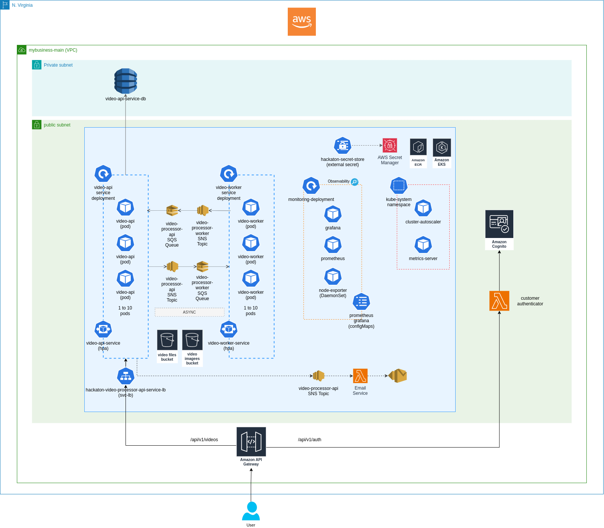

# Infrastructure - Video Image Processor Service

## Overview

This document provides a detailed technical overview of the infrastructure for the Video Processor Service, responsible for extracting images from video files. The infrastructure is deployed on AWS using Terraform, ensuring modularity and dynamic deployment across test and production environments.

This diagram above represents the cloud infrastructure for the **Video Processor Service**, deployed on **AWS** using **EKS, Lambda, Cognito, API Gateway, S3, DynamoDB, and messaging services (SNS/SQS)**.

### **Infrastructure Components Overview**
#### **1. Networking & VPC**
- **VPC: `mybusiness-main`** (green box)
- **Private Subnet**: contains the **video-api-service-db**, DynamoDB
- **Public Subnet**: where most of the service components are deployed

### **2. Video Processor Service (EKS)**
- **Kubernetes Cluster (EKS)**:
  - Hosts two main workloads:
    - **video-api-service** (API Gateway → Load Balancer → video-api pods)
    - **video-worker-service** (responsible for extracting images)
  - Uses **AWS Secrets Manager** for secret management via `hackaton-secret-store`
  - Includes observability stack with **Grafana, Prometheus, and node-exporter**

### **3. API Layer**
- **Amazon API Gateway**:
  - Routes requests from users to:
    - **`/api/videos`** → Load Balancer → **video-api-service**
    - **`/api/v1/accounts`** → **AWS Lambda for uer registration and authentication

### **4. Authentication (Cognito & Lambda)**
- **Amazon Cognito**:
  - Handles user authentication via a **user pool**
- **Customer Authentication Lambda**:
  - Validates users and generates auth tokens

### **5. Storage & Processing**
- **S3 Buckets**:
  - **Video Storage Bucket**: Stores uploaded videos
  - **Video Extracted Images Bucket**: Stores extracted images in ZIP format
- **DynamoDB**:
  - **`video-api-service-db`** used for video data information storage

### **6. Messaging & Async Processing**
- **SNS Topics & SQS Queues**:
  - **video-processor-api SNS Topic**: Emits messages from video processor api service
  - **video-processor-api SNS Queue**: Receives messages to video processor api service
  - **video-processor-worker SNS Topic**: Emits messages from video processor worker service
  - **video-processor-worker SNS Topic**: Receives messages to video processor worker service
- **Email Service**:
  - A lambda function used to notify users when image extraction is complete through email

### **7. Kubernetes Add-ons**
- **Cluster Autoscaler**: Adjusts node count dynamically
- **Metrics Server**: Enables Horizontal Pod Autoscaling (HPA)
- **Monitoring Stack**:
  - **Grafana & Prometheus**: Observability
  - **node-exporter**: Collects node metrics

### **Notes**

This architecture enables a **scalable**, **secure**, and **highly available** service for processing video files and extracting images. Kubernetes (EKS) ensures efficient container orchestration, while AWS-managed services (Cognito, API Gateway, S3, DynamoDB, SNS/SQS) provide security, storage, and asynchronous processing.

