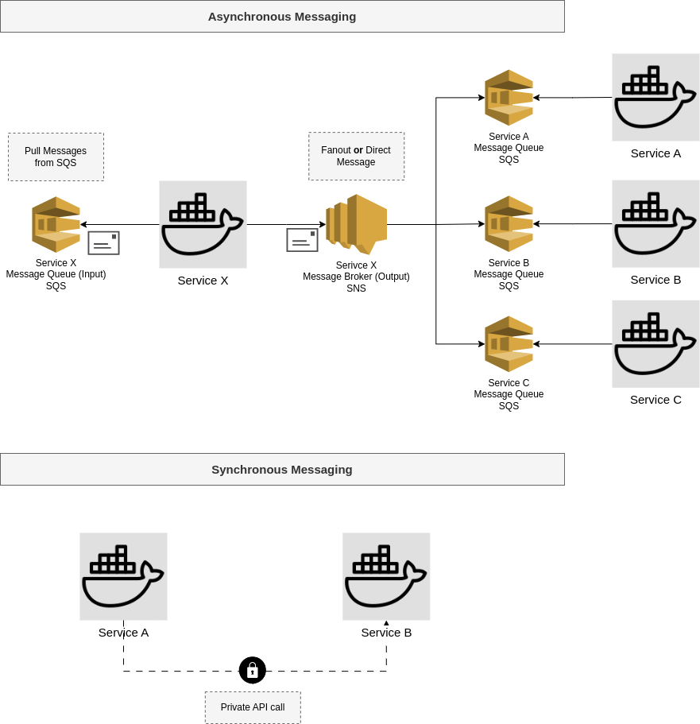

# Infrastructure - Video Image Processor Service

## Overview

This document provides a detailed technical overview of the infrastructure for the Video Processor Service, responsible for extracting images from video files. The infrastructure is deployed on AWS using Terraform, ensuring modularity and dynamic deployment across test and production environments.


This diagram above represents the cloud infrastructure for the **Video Processor Service**, deployed on **AWS** using **EKS, Lambda, Cognito, API Gateway, S3, DynamoDB, and messaging services (SNS/SQS)**.

### **Infrastructure Components Overview**
#### **1. Networking & VPC**
- **VPC: `mybusiness-main`** (green box)
- **Private Subnet**: contains the **video-api-service-db**, DynamoDB
- **Public Subnet**: where most of the service components are deployed


### **2. Video Processor Service (EKS)**
- **Kubernetes Cluster (EKS)**:
  - Hosts two main workloads:
    - **video-api-service** (API Gateway → Load Balancer → video-api pods)
    - **video-worker-service** (responsible for extracting images)
  - Uses **AWS Secrets Manager** for secret management via `hackaton-secret-store`
  - Includes observability stack with **Grafana, Prometheus, and node-exporter**


### **3. API Layer**
- **Amazon API Gateway**:
  - Routes requests from users to:
    - **`/api/videos`** → Load Balancer → **video-api-service**
    - **`/api/v1/accounts`** → **AWS Lambda for uer registration and authentication


### **4. Authentication (Cognito & Lambda)**
- **Amazon Cognito**:
  - Handles user authentication via a **user pool**
- **Customer Authentication Lambda**:
  - Validates users and generates auth tokens


### **5. Storage & Processing**
- **S3 Buckets**:
  - **Video Storage Bucket**: Stores uploaded videos
  - **Video Extracted Images Bucket**: Stores extracted images in ZIP format
- **DynamoDB**:
  - **`video-api-service-db`** used for video data information storage

### **6. Messaging & Async Processing**
- **SNS Topics & SQS Queues**:
  - **video-processor-api SNS Topic**: Emits messages from video processor api service
  - **video-processor-api SNS Queue**: Receives messages to video processor api service
  - **video-processor-worker SNS Topic**: Emits messages from video processor worker service
  - **video-processor-worker SNS Topic**: Receives messages to video processor worker service
- **Email Service**:
  - A lambda function used to notify users when image extraction is complete through email

### **7. Kubernetes Add-ons**
- **Cluster Autoscaler**: Adjusts node count dynamically
- **Metrics Server**: Enables Horizontal Pod Autoscaling (HPA)
- **Monitoring Stack**:
  - **Grafana & Prometheus**: Observability
  - **node-exporter**: Collects node metrics

## Service Messaging Pattern

We've defined two possible patterns of communication between services and they are described bellow.

<center></center>

### Synchronous Messaging

This pattern implies that when Service A needs to synchronously communicate with Service B, it calls a private API of Service B. This approach should be used only when the following conditions are met:

- **Service B is the owner of the data that Service A needs** to complete the execution of a business rule.
- **Service A cannot obtain this data from other sources**, such as cache or locally replicated data from Service B.
- **The information must be obtained in real-time**, otherwise, Service A will not be able to successfully execute the related business rule.

## Asynchronous Messaging

In most scenarios, it is possible to send messages from Service A to Service B asynchronously. This is preferred over synchronous messaging because it allows for non-blocking communication.

We have defined that each service on the Guardian Partner platform will have an input queue from which it receives messages targeted to it and an output topic to which it publishes messages intended for one or more services:

- **Input Messaging Source**: This is the queue from which the service receives messages sent to it. In our current implementation, this is AWS SQS.

- **Output Messaging Target**: This is the message topic to which the service publishes messages. The service publishes the message once, and it is the topic's responsibility to deliver it to the interested services. In our current implementation, this is AWS SNS.

**Input messaging source**

Each service must have it own SQS queue for messages intended for it. The service will only process messages from this channel whose **target field** (see below) is the services' name.

**Output messaging source**

There are two possible scenarios for targeting a message sent by a service:

- **Scenario 1 to 1**: In this case a message sent by service A is exclusively targeted to service B and no other service should receive it.

- **Scenario 1 to N**: In this case a message sent by service A is sent to N other services (_fanout_);

We use an architecture with AWS SNS + SQS services to address both scenarios. It is a cloud-based system where Service A can publish a message once, and all interested services can receive this message automatically, without Service A needing to know the specific queues of these services, even though the message is targeted to just one single service.

In this model, once Service A publishes a message to its SNS topic, SNS automatically "forwards" this message to Services B, C, and D via their respective SQS queues, all configured within AWS. If at any point, a service no longer needs to receive messages from Service A, its corresponding SQS queue can simply be deregistered. Conversely, if a new Service E needs to start receiving these messages, its SQS queue can be linked to Service A's SNS topic.

To address the **1 to 1 scenario**, we explore the concept of _message filtering_ with Amazon SNS. This approach allows us to filter the target of messages published by a service, determining which SQS queue the message should be routed to. By implementing message filtering, we can ensure that only the intended recipients receive the messages, maintaining efficiency and clarity in our communication patterns.

**Messaging Pattern**

Messages exchanged through asynchronous channels must adhere to the following pattern:

```
{
  sender: XXXXXXXXXX
  target: XXXXXXXXXX
  type: MSG_XXXXXXXXXXXX
  payload: { }
}
```

- **sender**: The name of the service sending the message
- **target**: The name of the service receiving the message
- **type**: The message name.
- **payload**: The message data in json format

For messages that are intended to a set of services, the target must be **MSG_SERVICE_ANY**. When SNS identifies this target, it sends the message to all SQS queues listening to that SNS topic.

### **Notes**

This architecture enables a **scalable**, **secure**, and **highly available** service for processing video files and extracting images. Kubernetes (EKS) ensures efficient container orchestration, while AWS-managed services (Cognito, API Gateway, S3, DynamoDB, SNS/SQS) provide security, storage, and asynchronous processing.

