# Load Test Results  

This document presents the results of a series of load tests conducted to assess the performance of the video image processor worker under high request volumes.  

## **Objective**  
The primary goal of these tests was to evaluate the system’s ability to handle a large number of video image extraction requests. The test strategy involved sending multiple processing requests to the video processor worker for previously uploaded video files. Additionally, the **video processor API** was subjected to high load due to the volume of processing result messages being sent back.  

## **Test Configuration**

During the test preparation phase, we identified that configuring more than **one goroutine per pod** caused **FFmpeg failures** under certain conditions. This issue is suspected to be related to **CPU and memory limitations per pod**. To mitigate this, we enforced a maximum of **one goroutine per pod**.  

Each goroutine processes a batch of **10 SQS messages** at a time. However, if **CPU or memory usage exceeds 40%**, the system scales the cluster horizontally, increasing the number of pods up to a maximum of **10** to accommodate demand.  

## **Results**

The test confirmed that the system successfully performed **horizontal scaling** as the volume of processing requests increased. The infrastructure dynamically adjusted to workload variations, ensuring stable and efficient processing.  

Only in a **stress test scenario** simulating **500 simultaneous video processing requests** did we encounter a single error. This failure is considered **acceptable**, as the test pushed the infrastructure to its **operational limits**. At this scale, the system would require **more than 10 pods** running in parallel to handle the load effectively.

## **Evidences**  

 - Before Tests
   - number of pods in execution: 2
   - number of vm's in execution: 2

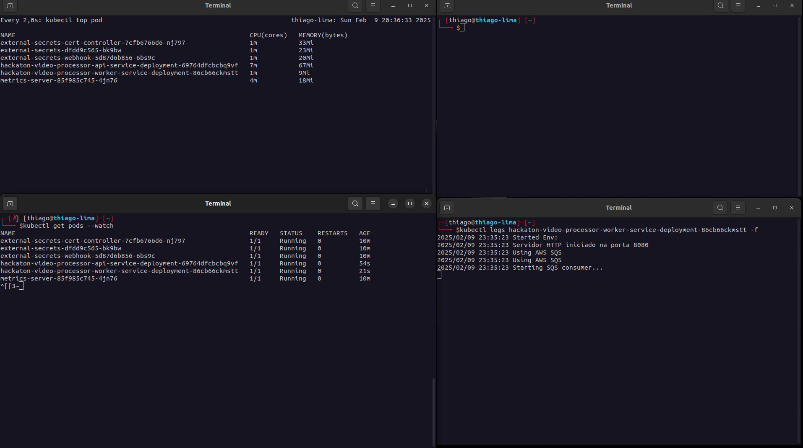
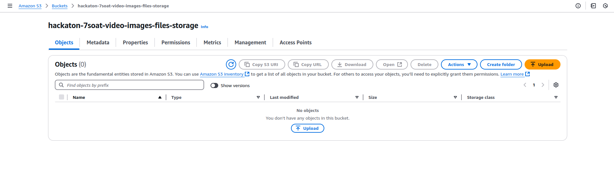
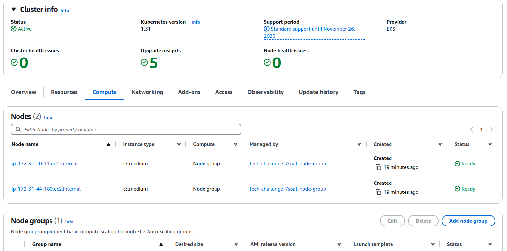

 - 50 messages
   - time to process all messages: ~1 minute 50 seconds
   - number of pods after the execution: 3
   - number of vm's after execution: 2
   - number of error: 0

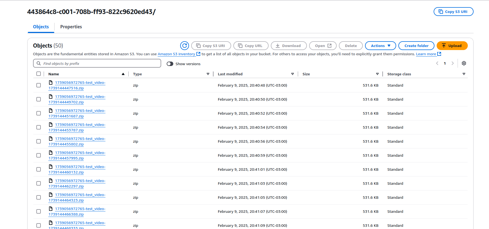
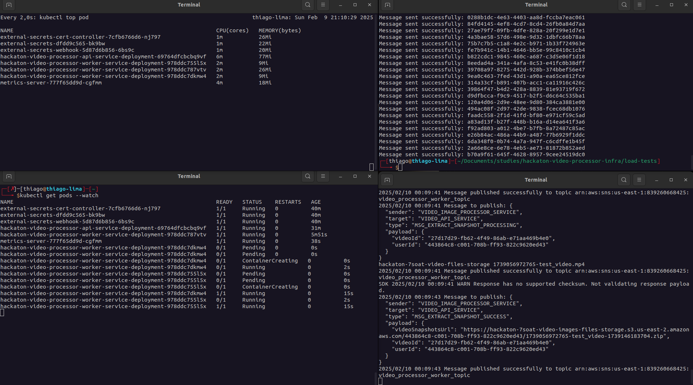

 - 100 messages
   - time to process all messages: 1 minute 25 seconds
   - number of pods after the execution: 6
   - number of vm's after execution: 3
   - number of error: 0

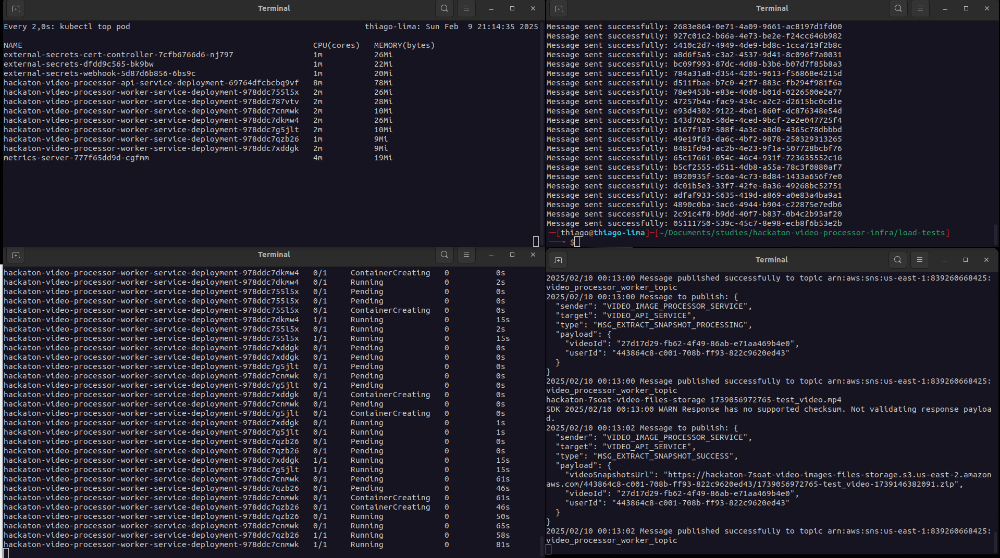
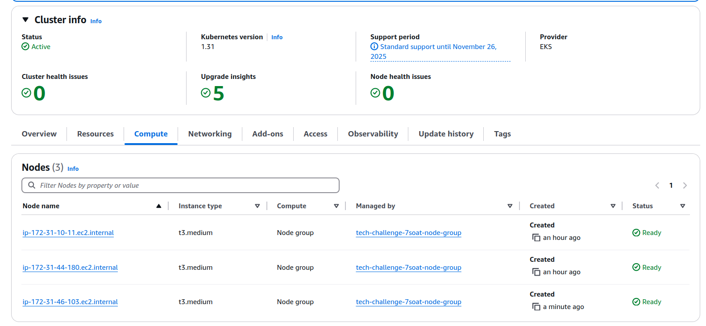
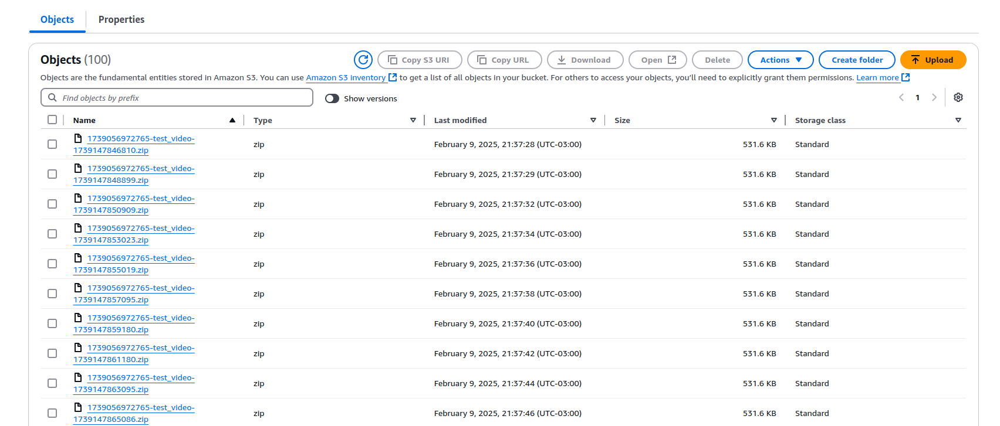

 - 500 messages
   - time to process all messages: 2 minutes 20 seconds
   - number of pods after the execution: 10
   - number of api pods after execution: 2
   - number of vm's after execution: 4
   - number of error: 1

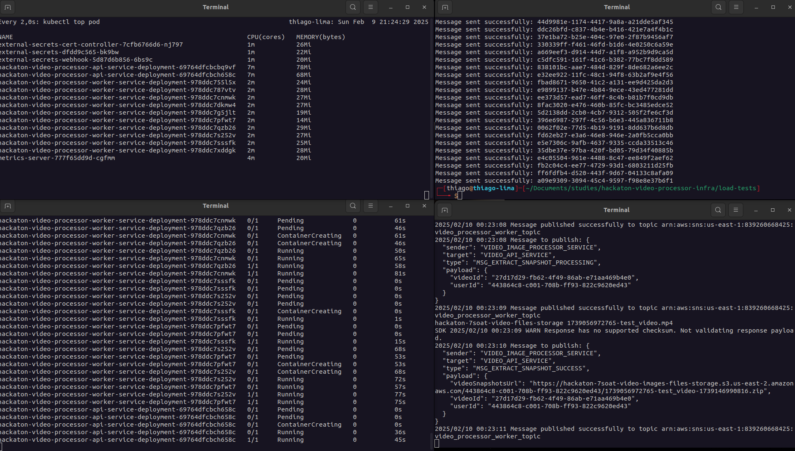
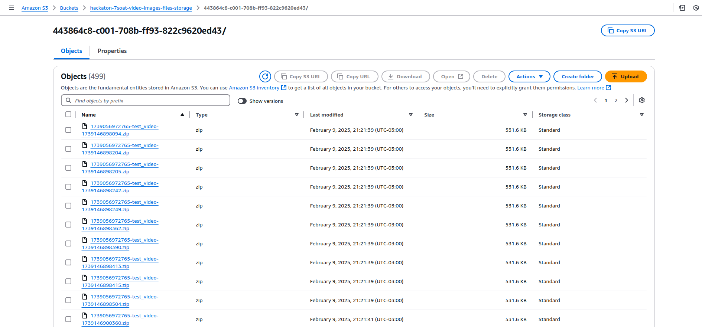
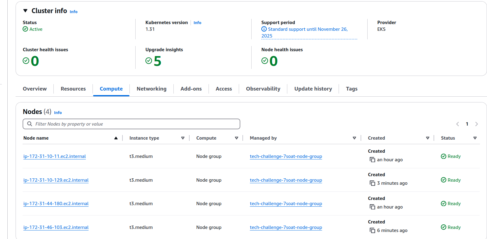